# QOI Format Codec


## 项目概述🖼️

QOI (Quite OK Image Format) 是一种轻量、简单而高效的图像无损压缩格式，由独立软件工程师 Dominic Szablewski 开发并推广。在测试中，QOI 能以数倍于 PNG 算法的效率无损压缩RGB或RGBA模式的图片，同时保有相近的图像压缩率。

本次大作业中，您将完成 QOI 的压缩、解压算法，实现一个简单的 QOI 编码解码器。

## 任务描述💡

### QOI Specification

**非常推荐直接阅读 qoi 格式的** [specification 文档](https://qoiformat.org/qoi-specification.pdf) **和** [原始 blog](https://phoboslab.org/log/2021/11/qoi-fast-lossless-image-compression)。

QOI格式图像由 `qoi_header`, `qoi_data`, `qoi_padding` 三部分构成。



#### qoi-header

存放高度、宽度、色彩通道种类等图片信息。

```cpp
qoi_header {
    char magic[4] = {'q', 'o', 'i', 'f'}; // magic bytes, 标志该图片采用qoi格式
    uint32_t width; // 图片的宽度
    uint32_t height; // 图片的高度
    uint8_t channels; // 色彩通道数, 值为3时表示RGB, 值为4时表示RGBA
    uint8_t colorspace = 0u; // 色彩空间类型, 本项目中默认为0, 表示sRGB with linear alpha
}
```

在 qoi 格式中的分布如下图：



#### qoi-data

存放经过压缩的像素序列信息。对于单个像素信息，有6种可选的压缩方式：

1. **QOI_OP_RUN**

2. **QOI_OP_INDEX**

3. **QOI_OP_DIFF**

4. **QOI_OP_LUMA**

5. **QOI_OP_RGB**

6. **QOI_OP_RGBA**

每种压缩方式由自身的标识符和压缩数据构成，保证编解码的唯一性。

#### qoi-padding

连续的 8 个 **byte** `0,0,0,0,0,0,0,1`，标志着qoi图像信息的结束。在qoi格式中的分布如下图：



## 需要实现的部分

**您只需要实现 `qoi.h` 的中的 `QoiEncode` 和 `QoiDecode` 函数，请不要改动其他文件的内容。**

### Encoder 编码器

```cpp
void QoiEncode(uint2_t width, uint32_t height, uint8_t channels, uint8_t colorspace);
```

接受未压缩的 rgb 序列输入，输出压缩后的 qoi 格式。

请使用 `QoiReadU8()` 从输入流中读取一个 `r` , `g` , `b` 或 `a` 分量的值，选择相应的压缩方式后，使用 `QoiWriteU8()` 输出。 

### Decoder 解码器

```cpp
void QoiDecode(uint2_t &width, uint32_t &height, uint8_t &channels, uint8_t &colorspace);
```

接受压缩后的 qoi 格式，输出未压缩的 rgb 序列输入。

请使用 `QoiReadU8()` 从输入流中读取一个压缩后的像素信息，按照标识符所对应的压缩方式解压，使用 `QoiWriteU8()` 输出 `r` , `g` , `b` 或 `a` 分量的值。

## 测评方法🚀

### 项目下载

推荐使用 git 将完整项目内容克隆到本地，详见 [项目下载](docs/clone.md)。

### 本地测试

`sample/` 文件夹下提供了样例数据，供大家参考和调试。测试方法详见 [本地测试](docs/local.md)。

> 为了让大家对 `.qoi` 格式有更加直观的认识，同时也为调试提供帮助，本项目配套的 [online playground](https://tools.acm.sjtu.app/qoi/) 已上线。
> 
> 感谢 [@1024th](https://github.com/1024th), [@Alan-Liang](https://github.com/Alan-Liang), [@LauYeeYu](https://github.com/LauYeeYu) 的技术支持。

### 在线评测

在 (OJ 对应题目)[https://acm.sjtu.edu.cn/OnlineJudge/homework?homework_id=388] 中提交你的程序。

**请将 `qoi.h` 文件中的完整内容拷贝到提交框中提交**，语言选择自动检测或c++。

## 分数构成✅

### 基础分 - 80%

参考OJ测评得分给出

+ A班：实现 **rgb 和 rgba 图像**的 qoi 编码解码算法

+ B班：实现 **rgb 图像**的 qoi 编码解码算法

### Code Review - 20%

+ 考查对QOI算法的理解

+ 代码风格检查

## 关于🌐

本项目仅作为 SJTU CS1953-01 课程大作业，供同学练习使用

有关qoi格式的更多信息见 [qoiformat.org](https://qoiformat.org/)
