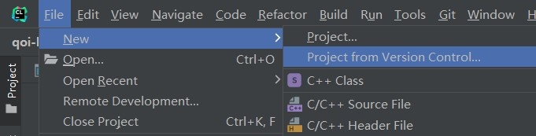
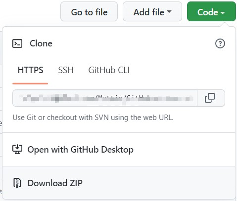

# 项目下载

## 使用git下载项目（推荐）

[Git](https://git-scm.com/) 是一个免费且开源的分布式项目版本控制工具。

可以使用 git 将本项目中的文档内容、测试数据和框架代码克隆到本地。

### 通过Clion

在新建项目时选择 `Project From Version Control`



在弹出窗口的 `URL` 一栏中填入本项目的 http 网址即可。

### 通过命令行

#### 在Windows环境下

如果你还未安装过 git 工具，请先[下载 git](https://git-scm.com/download/win)

接着进入对应的项目文件夹，右键选择 `Git Bash Here`，在命令行中输入：

```bash
git clone ...
```

#### 在wsl环境下

如果你还未安装过 git 工具，在命令行中输入：

```bash
sudo apt-get install git
```

接着进入对应的项目文件夹，运行：

```bash
git clone ...
```

## 使用其他方式下载项目

github 也支持以 `.zip` 格式下载项目内容。



将压缩包解压到对应项目文件夹，再使用 clion 或其他开发工具打开即可。
