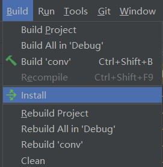
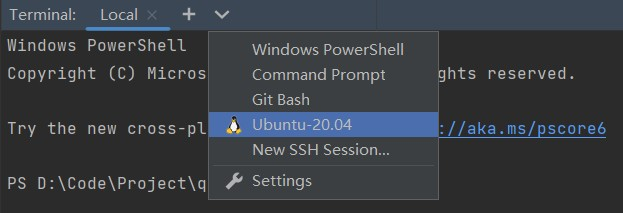
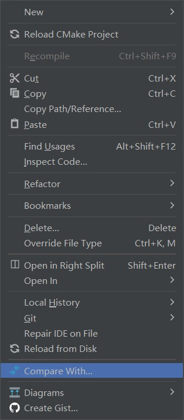
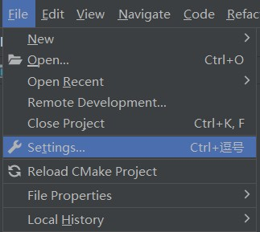
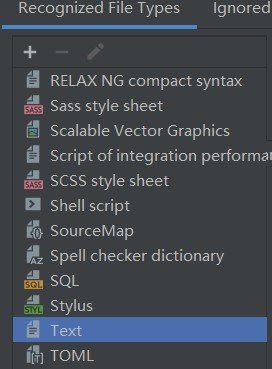
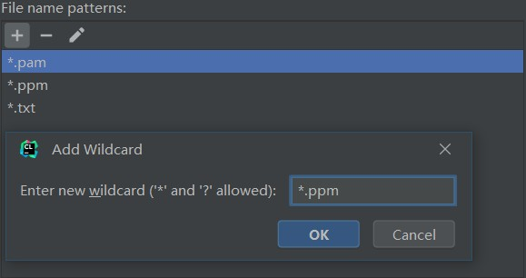

# 本地测试

【**此部分并无需要额外实现的代码**，仅供大家测试、熟悉 IDE 和命令行使用】

本项目实际上借助您编写的 QOI 编码解码器，实现了一个命令行图片格式转换小应用。

它可以实现 `qoi(rgb) <-> ppm` 和 `qoi(rgba) <-> pam` 的图片格式转换。

> **PPM** 全称 portable pixmap format，是一种**人类可读**的图片格式，其 RGB 像素信息直接以十进制数值的形式写在图片文件当中。
> 
> **PAM** 全称 portable arbitrary map，同样是一种**人类可读**的图片格式，我们用它来保存 RGBA 图片的像素信息。值得注意的是，在 PAM 格式中四个色彩通道信息以 ARGB 的顺序排列。
> 
> **您可以直接用文本编辑器打开 `.ppm` 或 `.pam` 格式的图片**，它们能帮助您检查您的解码结果是否正确。您也可以自己手动构造这两种格式的图片，用来测试编码结果是否符合预期。
> 
> 有关 PPM 和 PAM 格式的更多信息，详见 [PPM](https://en.wikipedia.org/wiki/Netpbm) 和 [PAM](https://netpbm.sourceforge.net/doc/pam.html)。

## A. 使用 CLion

### 1. 构建项目

在顶端菜单栏中选择 Build > Install



如果构建正常，此时在项目根目录中会出现一个名为 `conv` 的可执行文件，那就是我们的图片格式转换器。

> `qoi.h` 的内容出现改动时需要重新构建项目。

### 2. 使用命令行应用转换图片格式

 点击底端菜单栏中的 Terminal 一项，在弹出的窗口中新建 WSL 命令行窗口



在 WSL 命令行中运行 `./conv` 并附上相应参数来使用应用

> **【参数说明】**
> 
> + **格式转换参数** `-d`, `-e`
>   
>   使用 `-d` 表示解码 qoi 图像，进行 qoi 到 ppm/pam 类型的转换
>   
>   使用 `-e` 表示编码 qoi 图像，进行 ppm/pam 到 qoi 类型的转换
>   
>   `-d` 与 `-e` 参数不能同时使用
> 
> + **色彩通道参数** `-3`, `-4`
>   
>   使用 `-3` 表示图像色彩通道数为3，进行 rgb 图像的类型转换
>   
>   使用 `-4` 表示图像色彩通道数为4，进行 rgba 图像的类型转换
> 
> + **图片路径参数** `< path/to/input/image`, `> path/to/output/image`
>   
>   重定向图片文件读写流到标准输入输出，详见使用例
> 
> + **临时文件参数** `-o`
>   
>   转换器默认会生成一个名为 `temp.rgb` 或 `temp.rgba` 的临时 rgb(a) 序列文件
>   
>   可以选择使用 `-o` 参数来忽略 (omit) 该临时文件
> 
> **【使用例】**
> 
> 将 `sample/rgb/` 文件夹下的 `pic1.qoi` 图片转换为 `picture.ppm` 图片并输出到当前文件夹，进行 rgb 图像解码测试
> 
> ```bash
> ./conv -d -3 <sample/rgb/pic1.qoi >picture.ppm
> ```
> 
> 将 `sample/rgb/` 文件夹下的 `pic2.ppm` 图片转换为 `pic.qoi` 图片并输出到 `out/` 文件夹（如果该文件夹存在），进行 rgb 图像编码测试，并忽略临时文件
> 
> ```bash
> ./conv -e -3 <sample/rgb/pic2.ppm >out/pic.qoi -o
> ```
> 
> 将 `sample/rgba/` 文件夹下的 `dice.qoi` 图片转换为 `dice.pam` 图片并输出到 `out/` 文件夹（如果该文件夹存在），进行 rgba 图像解码测试，并忽略临时文件
> 
> ```bash
> ./conv -d -4 <sample/rgba/dice.qoi >out/dice.pam -o
> ```
> 
> 将 `sample/rgba/` 文件夹下的 `logo.pam` 图片转换为 `logo.qoi` 图片并输出到当前文件夹，进行 rgba 图像编码测试
> 
> ```bash
> ./conv -e -4 <sample/rgba/logo.pam >logo.qoi
> ```

运行 `./conv -h` 查看应用使用方法的详细说明

### 3. 检查转换结果是否正确

您可以使用 CLion 自带的文本比较功能来判断转换结果是否正确

右键点击您的转换输出文件比，选择 Compare With...



在弹出的窗口中选中样例数据中相应的文件。如果出现了 `Contents are identical` 的提示信息，那么恭喜您，您的转换结果是正确的；否则 CLion 会提示您不一致内容的所在位置，您可以根据此调试自己的代码。

> **【以下是可选的设置内容】**
> 
> CLion 默认将 `.ppm` 与 `.pam` 以图片格式打开，但我们可以通过调整 File Types 设置来以文本格式查看它们。
> 
> 在顶端菜单栏中选择 File > Settings...
> 
> 
> 
> 在弹出的设置窗口中选择 Editor > File Types
> 
> 在 Recognized File Types 中选择 Text
> 
> 
> 
> 在右侧的 File name patterns 中新增 `*.ppm` 和 `*.pam` 两项
> 
> 
> 
> 这里可能会会有类型冲突的提示，选择 Reassign 即可

## B. 使用命令行

### 1. 编译项目

在项目根目录运行 `g++ main.cpp -o conv` 编译程序

### 2. 使用命令行应用转换图片格式

与 A.2 使用方法相同，不再赘述

### 3. 检查转换结果是否正确

运行 `diff path/to/your/file path/to/std/file` 进行文件比较，没有输出表示文件没有差异
